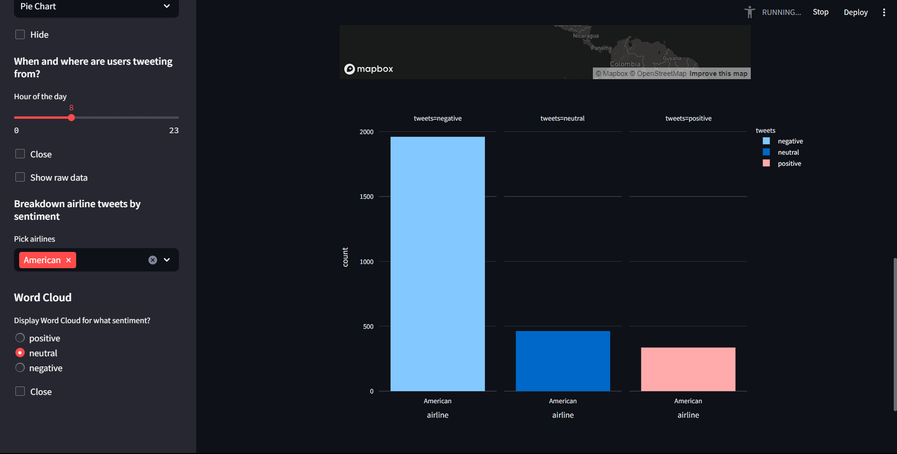

# Sentiment Analysis of Tweets about US Airlines using Streamlit and Python

## Overview
This Streamlit dashboard analyzes the sentiment of tweets about US Airlines. It provides visualizations, insights, and allows users to explore the sentiment of tweets based on different criteria.

## Introduction
This application is built using Streamlit, pandas, numpy, plotly express, and the wordcloud library. The sentiment analysis is performed on a dataset containing tweets about US Airlines.

## Features

### 1. Sentiment Analysis
- The dashboard provides an overview of sentiment distribution through visualizations like histograms and pie charts.
- Users can choose to display random tweets for positive, neutral, or negative sentiment.

### 2. Hourly Tweet Distribution
- Users can explore tweet locations based on the time of the day, using an interactive map.

### 3. Airline Breakdown
- The dashboard allows users to pick specific airlines and view a histogram of tweets for each airline, categorized by sentiment.

### 4. Word Cloud
- Users can generate word clouds for positive, neutral, or negative sentiment to visualize common words used in tweets.

## Instructions
1. Clone the repository.
2. Install the required libraries using `pip install -r requirements.txt`.
3. Run the Streamlit app using `streamlit run app.py`.
4. Interact with the dashboard to explore sentiment analysis of tweets about US Airlines.

## Usage
- The sidebar provides various options for exploring and visualizing tweet sentiments.
- Users can filter tweets based on sentiment, hour of the day, specific airlines, and generate word clouds.

## Interface

## Contributions
Contributions are welcome! If you find any issues or have suggestions, feel free to open an issue or submit a pull request.

